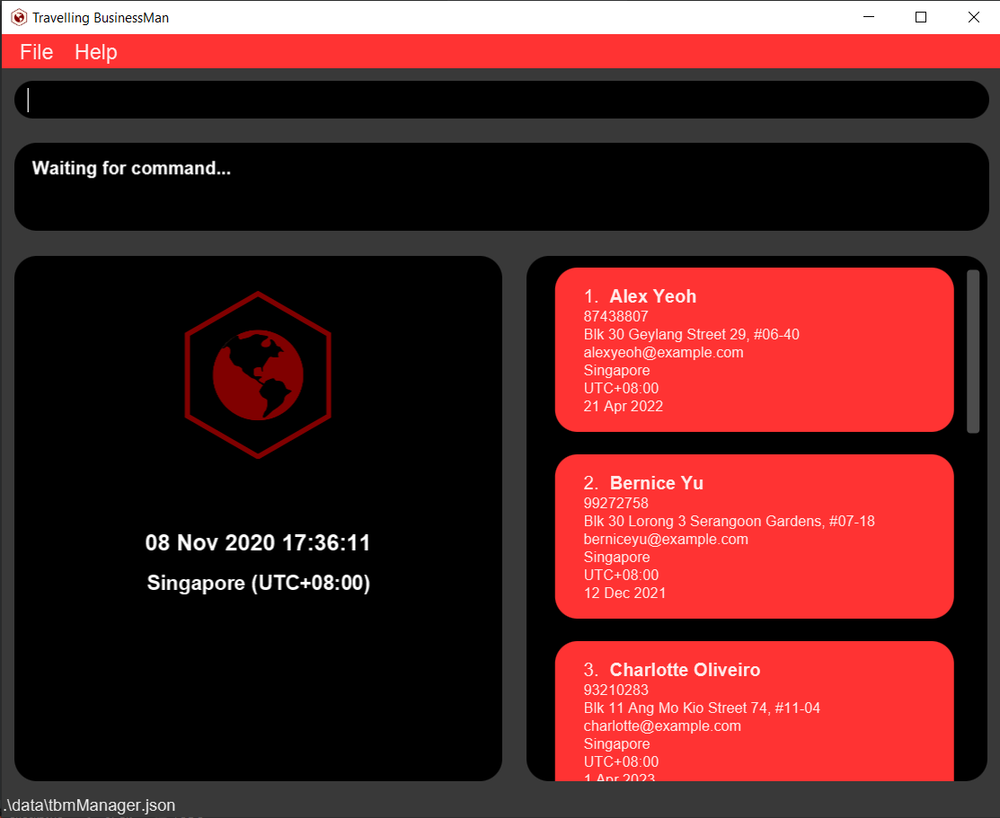

- This is a **brownfield team project done under NUS's CS2103T: Software Engineering**. 
  - It has been built up from an ongoing software project for a desktop application (called _AddressBook_) used for managing contact details. This provides a **reasonably well-written** code base **bigger** (around 6 KLoC) than what students usually write in beginner-level SE modules, without being overwhelmingly big.
  - It is **written in OOP fashion**.
  - It has **user and developer documentation**
  - For detailed documentation, please refer to the **[TBM Website](https://ay2021s1-cs2103t-f11-4.github.io/tp/)**.

This project is based on the AddressBook-Level3 project created by the [SE-EDU initiative](https://se-education.org).
