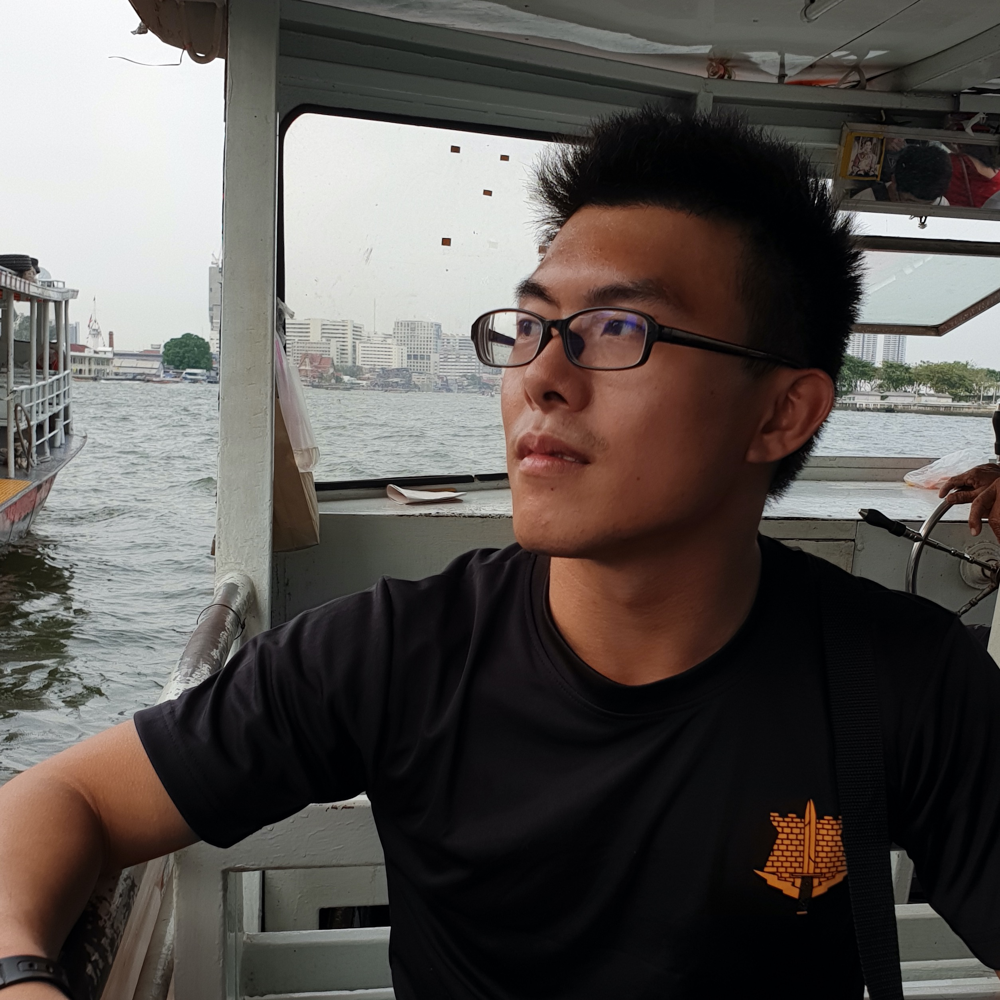

We are a team based in the [School of Computing, National University of Singapore](http://www.comp.nus.edu.sg).

You can reach us at the email `university@rocketmail.com`

## Project team

### Tan Kang Liang

[[github](https://github.com/tankangliang)]
[[portfolio](team/tankangliang.md)]

* Role: In charge of deliverables and deadlines
* Responsibilities: Ensure project deliverables are done on time and in the right format.

### Lim Ming Chong

[[github](http://github.com/qwoprocks)]
[[portfolio](team/qwoprocks.md)]

* Role: In charge of integration
* Responsibilities: In charge of versioning of the code, maintaining the code repository, integrating various parts of the software to create a whole.

### Lee En Hao

[[github](http://github.com/leeenhao)]
[[portfolio](team/leeenhao.md)]

* Role: In charge of documentation and scheduling
* Responsibilities: In charge of defining, assigning, and tracking project tasks as well as
the quality of various project documents.

### raysonkoh

[[github](http://github.com/raysonkoh)]
[[portfolio](team/raysonkoh.md)]

* Role: In charge of testing
* Responsibilities: Ensures the testing of the project is done properly and on time

### Ritesh Kumar

[[github](http://github.com/rtshkmr)]
[[portfolio](team/rtshkmr.md)]

* Role: Team Lead, In charge of code quality
* Responsibilities: Responsible for overall project coordination and looks after code quality, ensures adherence to coding standards.
