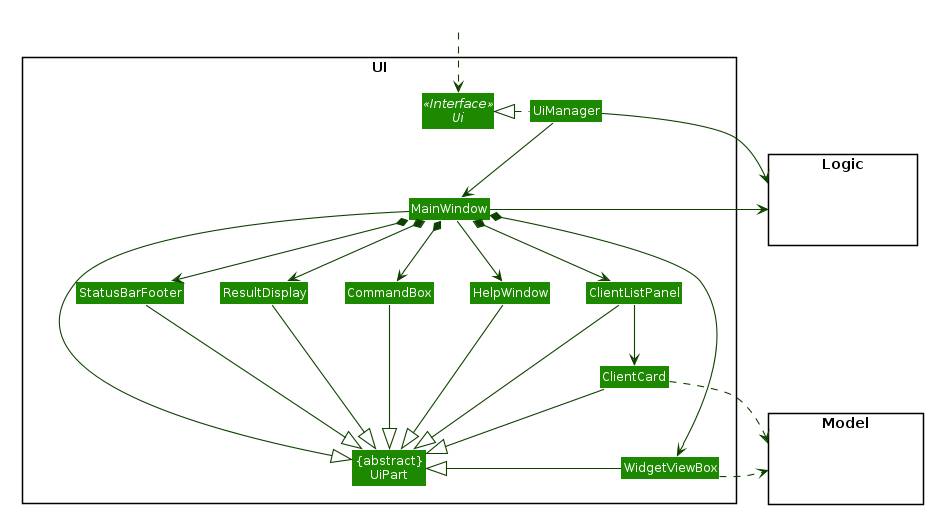
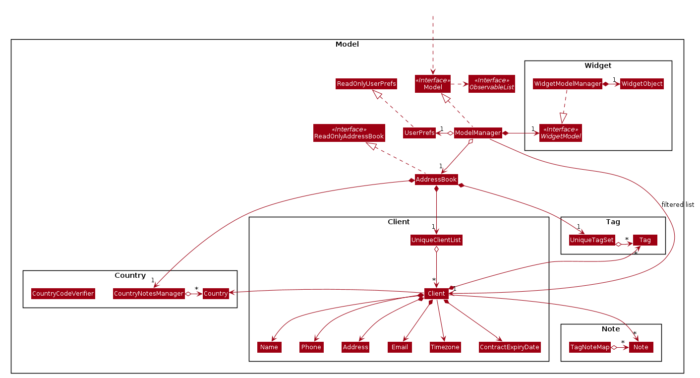
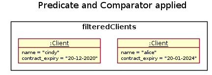
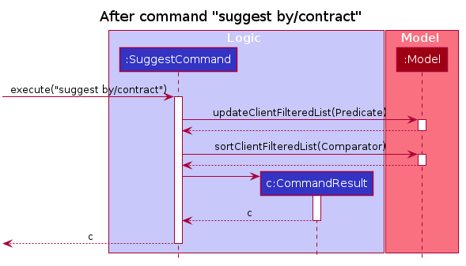

## **Introduction**

### Purpose

This documentation specifies the architecture and design decisions for the application, <strong><i>Travelling BusinessMan</i></strong>.

### Scope

This describes the software architecture and software design decisions for the implementation of <strong><i>TBM</i></strong>. The intended audience is the developers, designers and testers for the application.

* Table of Contents
{:toc}

--------------------------------------------------------------------------------------------------------------------

## **Setting up, getting started**

Refer to the guide [_Setting up and getting started_](SettingUp.md).

--------------------------------------------------------------------------------------------------------------------

## **Design**

### Architecture

The ***Architecture Diagram*** given above explains the high-level design of the App. Given below is a quick overview of each component.

:bulb: **Tip:** The `.puml` files used to create diagrams in this document can be found in the [diagrams](https://github.com/AY2021S1-CS2103T-F11-4/tp/tree/master/docs/diagrams) folder. Refer to the [_PlantUML Tutorial_ at se-edu/guides](https://se-education.org/guides/tutorials/plantUml.html) to learn how to create and edit diagrams.

**`Main`** has two classes called [`Main`](https://github.com/AY2021S1-CS2103T-F11-4/tp/tree/master/src/main/java/seedu/address/Main.java) and [`MainApp`](https://github.com/AY2021S1-CS2103T-F11-4/tp/master/src/main/java/seedu/address/MainApp.java). It is responsible for,
* At app launch: Initializes the components in the correct sequence, and connects them up with each other.
* At shut down: Shuts down the components and invokes cleanup methods where necessary.

[**`Commons`**](#common-classes) represents a collection of classes used by multiple other components.

The rest of the App consists of four components.

* [**`UI`**](#ui-component): The UI of the App.
* [**`Logic`**](#logic-component): The command executor.
* [**`Model`**](#model-component): Holds the data of the App in memory.
* [**`Storage`**](#storage-component): Reads data from, and writes data to, the hard disk.

Each of the four components,

* defines its *API* in an `interface` with the same name as the Component.
* exposes its functionality using a concrete `{Component Name}Manager` class (which implements the corresponding API `interface` mentioned in the previous point.

For example, the `Logic` component (see the class diagram given below) defines its API in the `Logic.java` interface and exposes its functionality using the `LogicManager.java` class which implements the `Logic` interface.

**How the architecture components interact with each other**

The *Sequence Diagram* below shows how the components interact with each other for the scenario where the user issues the command `client delete 1`.

The sections below give more details of each component.

### UI component

**API** :
[`Ui.java`](https://github.com/AY2021S1-CS2103T-F11-4/tp/tree/master/src/main/java/seedu/address/ui/Ui.java)

The UI consists of a `MainWindow` that is made up of parts e.g.`CommandBox`, `ResultDisplay`, `ClientListPanel`, `WidgetViewBox`, `StatusBarFooter`, etc. All these, including the `MainWindow`, inherit from the abstract `UiPart` class.

The `UI` component uses JavaFx UI framework. The layout of these UI parts are defined in matching `.fxml` files that are in the `src/main/resources/view` folder. For example, the layout of the [`MainWindow`](https://github.com/AY2021S1-CS2103T-F11-4/tp/tree/master/src/main/java/seedu/address/ui/MainWindow.java) is specified in [`MainWindow.fxml`](https://github.com/AY2021S1-CS2103T-F11-4/tp/tree/master/src/main/resources/view/MainWindow.fxml)
The `UI` component,

* Executes user commands using the `Logic` component.
* Listens for changes to `Model` data so that the UI can be updated with the modified data.

### Logic component

**API** :
[`Logic.java`](https://github.com/AY2021S1-CS2103T-F11-4/tp/tree/master/src/main/java/seedu/address/logic/Logic.java)

1. `Logic` uses the `AddressBookParser` class to parse the user command.
1. This results in a `Command` object which is executed by the `LogicManager`.
1. The command execution can affect the `Model` (e.g. adding a client).
1. The result of the command execution is encapsulated as a `CommandResult` object which is passed back to the `Ui`.
1. In addition, the `CommandResult` object can also instruct the `Ui` to perform certain actions, such as displaying help to the user.

Given below is the Sequence Diagram for interactions within the `Logic` component for the `execute("delete 1")` API call.

:information_source: **Note:** The lifeline for `DeleteCommandParser` should end at the destroy marker (X) but due to a limitation of PlantUML, the lifeline reaches the end of diagram.

### Model component

**API** : [`Model.java`](https://github.com/AY2021S1-CS2103T-F11-4/tp/tree/master/src/main/java/seedu/address/model/Model.java)

The `Model`,

* stores a `UserPref` object that represents the user’s preferences.
* stores the address book data.
* exposes an unmodifiable `ObservableList<Client>` that can be 'observed' e.g. the UI can be bound to this list so that the UI automatically updates when the data in the list change.
* does not depend on any of the other three components.
* contains a `UniqueTagSet` to prevent duplication of `Tag` objects.

#### Inner Workings of TBM

<!--- TODO: Add a full explanation of the interaction between Note, Tag and Country, with class and sequence diagrams? -->

The above Model diagram provides a high level view of how TBM functions. However, is does not fully represent the class design between Note, Country and Tag.
This sub-section gives a better explanation of the mappings for Note, Tag and Country.

### Storage component

**API** : [`Storage.java`](https://github.com/AY2021S1-CS2103T-F11-4/tp/tree/master/src/main/java/seedu/address/storage/Storage.java)

The `Storage` component,
* can save `UserPref` objects in json format and read it back.
* can save the address book data in json format and read it back.

### Common classes

Classes used by multiple components are in the `seedu.addressbook.commons` package.

--------------------------------------------------------------------------------------------------------------------

## **Implementation**

This section describes some noteworthy details on how certain features are implemented.

### Associating Notes and Tags

The proposed association mechanism between `Tag` and `Note` objects is facilitated by `TagNoteMap`. 
It is stored internally within the `Addressbook` object. Additionally, it implements the following operations:

* `TagNoteMap#getTagsForNote()` — Returns an unmodifiable set of Tags associated to a particular Note.

* `TagNoteMap#updateTagsForNote()` — Returns an unmodifiable set of Notes associated to a particular Tag .

* `TagNoteMap#initTagNoteMapFromNotes()` —  Initialises the TagNoteMap from a set of Notes.

The `TagNoteMap#initTagNoteMapFromNotes()` is exposed in the `Model` interface as `Model#initialiseTagNoteMap()`.

Given below is an example usage scenario and how mapping mechanism behaves at each step.

### Suggesting contacts

#### Implementation

The suggestion mechanism is facilitated by `filteredClients` in `ModelManager`. It is an instance of `javafx.collections.transformation.FilteredList<Client>`. It implements the following relevant operations:
* `FilteredList<Client>#setPredicate(Predicate<? super Client> p)` — Filters out any clients that do not match the predicate in the list.
* `FilteredList<Client>#sort(Comparator<? super Client> p)` — Sorts the list.

These operations are exposed in the `Model` interface as `Model#updateFilteredClientList()` and `Model#sortFilteredClientList()` respectively.

The following activity diagram summarizes what happens when a user inputs a `suggest` command.

Given below is an example usage scenario and how the suggestion mechanism behaves at each step.

Step 1: The user executes `suggest by/contract` to list the suggested clients sorted by contract expiry dates. At this point, `filteredClients` is showing all clients.

Step 2: The `suggest` command calls `Model#updateFilteredClientList` with the contract expiry date predicate (which checks if a client has a contract expiry date). `Model` updates the `filteredClients` object with the contract expiry date predicate which filters out all clients without an existing contract expiry date.

Step 3: The `suggest` command calls `Model#sortFilteredClientList` with the contract expiry date comparator (which sorts clients by earliest contract expiry date). `Model` updates the `filteredClients` object with the contract expiry date comparator which gives us clients in order of increasing contract expiry date.

Step 4: The change is then propagated to `Ui`, which updates the displayed clients in `ClientListPanel`.

Step 5: The user decides to execute the command `list`, which resets the `filteredClients` objects to have all clients, and in turn resets the displayed clients in `ClientListPanel` as well. 

The following sequence diagram shows how the suggest operation works:

### \[Proposed\] Undo/redo feature

#### Proposed Implementation

The proposed undo/redo mechanism is facilitated by `VersionedAddressBook`. It extends `AddressBook` with an undo/redo history, stored internally as an `addressBookStateList` and `currentStatePointer`. Additionally, it implements the following operations:

* `VersionedAddressBook#commit()` — Saves the current address book state in its history.
* `VersionedAddressBook#undo()` — Restores the previous address book state from its history.
* `VersionedAddressBook#redo()` — Restores a previously undone address book state from its history.

These operations are exposed in the `Model` interface as `Model#commitAddressBook()`, `Model#undoAddressBook()` and `Model#redoAddressBook()` respectively.

Given below is an example usage scenario and how the undo/redo mechanism behaves at each step.

Step 1. The user launches the application for the first time. The `VersionedAddressBook` will be initialized with the initial address book state, and the `currentStatePointer` pointing to that single address book state.

Step 2. The user executes `delete 5` command to delete the 5th client in the address book. The `delete` command calls `Model#commitAddressBook()`, causing the modified state of the address book after the `delete 5` command executes to be saved in the `addressBookStateList`, and the `currentStatePointer` is shifted to the newly inserted address book state.

Step 3. The user executes `add n/David …​` to add a new client. The `add` command also calls `Model#commitAddressBook()`, causing another modified address book state to be saved into the `addressBookStateList`.

:information_source: **Note:** If a command fails its execution, it will not call `Model#commitAddressBook()`, so the address book state will not be saved into the `addressBookStateList`.

Step 4. The user now decides that adding the client was a mistake, and decides to undo that action by executing the `undo` command. The `undo` command will call `Model#undoAddressBook()`, which will shift the `currentStatePointer` once to the left, pointing it to the previous address book state, and restores the address book to that state.

:information_source: **Note:** If the `currentStatePointer` is at index 0, pointing to the initial AddressBook state, then there are no previous AddressBook states to restore. The `undo` command uses `Model#canUndoAddressBook()` to check if this is the case. If so, it will return an error to the user rather
than attempting to perform the undo.

The following sequence diagram shows how the undo operation works:

:information_source: **Note:** The lifeline for `UndoCommand` should end at the destroy marker (X) but due to a limitation of PlantUML, the lifeline reaches the end of diagram.

The `redo` command does the opposite — it calls `Model#redoAddressBook()`, which shifts the `currentStatePointer` once to the right, pointing to the previously undone state, and restores the address book to that state.

:information_source: **Note:** If the `currentStatePointer` is at index `addressBookStateList.size() - 1`, pointing to the latest address book state, then there are no undone AddressBook states to restore. The `redo` command uses `Model#canRedoAddressBook()` to check if this is the case. If so, it will return an error to the user rather than attempting to perform the redo.

Step 5. The user then decides to execute the command `list`. Commands that do not modify the address book, such as `list`, will usually not call `Model#commitAddressBook()`, `Model#undoAddressBook()` or `Model#redoAddressBook()`. Thus, the `addressBookStateList` remains unchanged.

Step 6. The user executes `clear`, which calls `Model#commitAddressBook()`. Since the `currentStatePointer` is not pointing at the end of the `addressBookStateList`, all address book states after the `currentStatePointer` will be purged. Reason: It no longer makes sense to redo the `add n/David …​` command. This is the behavior that most modern desktop applications follow.

The following activity diagram summarizes what happens when a user executes a new command:

#### Design consideration:

##### Aspect: How undo & redo executes

* **Alternative 1 (current choice):** Saves the entire address book.
  * Pros: Easy to implement.
  * Cons: May have performance issues in terms of memory usage.

* **Alternative 2:** Individual command knows how to undo/redo by
  itself.
  * Pros: Will use less memory (e.g. for `delete`, just save the client being deleted).
  * Cons: We must ensure that the implementation of each individual command are correct.

_{more aspects and alternatives to be added}_

### \[Proposed\] Data archiving

_{Explain here how the data archiving feature will be implemented}_

--------------------------------------------------------------------------------------------------------------------

## **Documentation, logging, testing, configuration, dev-ops**

* [Documentation guide](Documentation.md)
* [Testing guide](Testing.md)
* [Logging guide](Logging.md)
* [Configuration guide](Configuration.md)
* [DevOps guide](DevOps.md)

--------------------------------------------------------------------------------------------------------------------

## **Appendix: Requirements**

### Product scope

**Target user profile**: Businesspeople who travel a lot

* has a need to manage a significant number of clients that span multiple timezones
* prefers desktop apps over other types
* can type fast
* prefers typing to mouse interactions
* is reasonably comfortable using CLI apps

**Value proposition**: Manages notes, client contact details and preferences across multiple countries and timezones

### User stories

Priorities: High (must have) - `* * *`, Medium (nice to have) - `* *`, Low (unlikely to have) - `*`

| Priority | As a …​                                    | I want to …​                     | So that I can…​                                                        |
| -------- | --------------------------------- | ---------------------------------------- | ---------------------------------------------------------------------- |
| `* * *`  | potential user                    | see the App populated with sample data   | easily see how the App will look like when it is in use                |
| `* * *`  | user ready to start using the App | purge all current data                   | get rid of sample/experimental data I used to explore the app          |
| `* * *`  | new user                          | see usage instructions                   | refer to instructions when I forget how to use the App                 |
| `* * *`  | user                              | add contact details of business contacts |                                                                        |
| `* * *`  | user                              | add personal preferences of existing business contacts | keep track of them                                       |
| `* * *`  | user                              | add meeting notes after meeting with existing business contacts | keep track of my meetings                       |
| `* * *`  | user                              | add information on business deals and contract expiration dates | let TBM keep track of them                      |
| `* * *`  | user                              | filter business contacts by country      |                                                                        |
| `* * *`  | user                              | add cultural or relevant notes regarding a specific country | refer to these notes in the future                  |
| `* * *`  | user                              | view my previously added information regarding a country |                                                        |
| `* * *`  | user                              | see and search for all my clients        | easily find and view information on my clients without having to go through the entire list |
| `* * *`  | user                              | edit my clients' information           |                                                                        |
| `* * *`  | user                              | save the information I enter             |                                                                        |
| `* * *`  | user                              | transfer my data across different computers |                                                                     |
| `* * *`  | user                              | manage the priority of business aspects regarding my clients (e.g. expiring contracts) |                          |
| `* * *`  | user                              | receive suggestions on which clients to catch up on if I have not done so for quite long | maintain my relationship with my clients |
| `* * *`  | user                              | view who is likely to be free in other timezones currently | contact them and catch up with them                  |
| `* * *`  | user                              | delete a client                          | remove entries that I no longer need                                   |
| `* * *`  | user                              | note down and be reminded when my clients have their noteworthy moments (dates) | congratulate them in a timely manner |
| `* *`    | long-time user                    | archive/hide unused data                 | not be distracted by irrelevant data                                   |
| `* *`    | user                              | manage my flight bookings across countries |                                                                      |
| `* *`    | user                              | manage my hotel bookings in a particular country |                                                                |
| `* *`    | user                              | visualize my flight and hotel bookings on a timeline |                                                            |
| `* *`    | user                              | filter business contacts by country and state |                                                                   |
| `* *`    | user                              | undo and redo                                 | correct my mistakes easily                                        |
| `*`      | user                              | hide private contact details             | minimize chance of someone else seeing them by accident                |
| `*`      | user                              | find clients nearest to my current location   | find someone near me to meet                                      |
| `*`      | user                              | customize the GUI   | make it more intuitive to use or more visually appealing                                    |
| `*`      | proficient CLI user               | type out my emails straight from the application without moving to the browser | have a faster workflow           |

### Use cases

(For all use cases below, the **System** is the `TBM` and the **Actor** is the `user`, unless specified otherwise)

**UC1 - Adding a Client**

**MSS**

1.  User meets secures a new business deal/client
2.  User attempts to add the all associated parties and their information into TBM.
3.  User successfully adds the all new information into TBM.

    Use case ends.

**Extensions**

* 2a. A party has a prior entry in TBM, which shows that User has a previous professional encounter with the party.

    * 2a1. User does not add the new party as it will duplicate entries in the TBM.
    * 2a2. User can choose to update/edit the client information instead.

  Use case ends.

**UC2 - Finding Clients**

**MSS**

1.  User requests to find a client.
2.  TBM shows a list of clients that match user's query.

    Use case ends.

**Extensions**

* 1a. The list of clients is empty.

  Use case ends.

**UC3 - Saving data**

**MSS**

1.  User enters a valid command that alters data (E.g. <u>`adding a client (UC1)`</u>).
2.  Modified data gets stored in the existing data file.
3.  TBM shows a message indicating command has been executed successfully.

    Use case ends.

**Extensions**

* 2a. An error occurred while saving the modified data to the existing data file.

    * 2a1. TBM reloads the data from the existing data file.
    * 2a2. TBM shows an error message.

  Use case ends.

**UC4 - Filtering by country**

**MSS**

1. User inputs a country as filter.
2. TBM shows all clients belonging to that country.

   Use case ends.

**Extensions**

* 1a. Invalid country is given.

    * 1a1. TBM shows an error message.

      Use case ends.

**UC5 - Clearing all entries from TBM**

**MSS**

1.  User requests to clear all entries.
2.  TBM asks the user to confirm.
3.  User confirms that they want to clear all entries.
4.  TBM clears all entries.

    Use case ends.

**Extensions**

* 1a. There are no entries.

  Use case ends.

* 3a. User decides not to clear all entries.

  Use case ends.

*{More to be added}*

### Non-Functional Requirements

1.  **TBM** should work on any _mainstream OS_ as long as it has Java `11` or above installed.
2.  A user with above average typing speed for regular English text (i.e. not code, not system admin commands) should be able to accomplish most of the tasks faster using commands than using the mouse.
4.  **TBM** should be able to recover its previous stable state from the data file if it crashes.
3.  The data file should be stored locally in a human-editable text file.
4.  **TBM** should be used by a single user.
5.  **TBM** should be able to hold up to 1000 business contacts without a noticeable sluggishness in performance for typical usage.
6.  **TBM** should be able to hold up to 5000 total client notes without a noticeable sluggishness in performance for typical usage.
7.  **TBM** can handle at most 10000 business contacts and at most 50000 total client notes.
8.  **TBM** will only accept countries that are specified by the [ISO3166](https://en.wikipedia.org/wiki/List_of_ISO_3166_country_codes) specification.
9.  **TBM** will only accept [GMT](https://en.wikipedia.org/wiki/Greenwich_Mean_Time) timezones.
10. **TBM** is not required to validate that the timezone of a business contact correctly matches his/her country.
11. **TBM** should retain all functionalities even when it is not connected to the internet.
12. The size of the **TBM** _JAR_ file should not exceed 100Mb.

### Glossary

* **Business Contact**: Synonymous with **Client**
* **Client**: Refers to a person whom the user is conducting his/her business with
* **GMT**: [Greenwich Mean Time](https://en.wikipedia.org/wiki/Greenwich_Mean_Time)
* **Mainstream OS**: Windows, Linux, Unix, OS-X
* **TBM**: Initialism for Travelling BusinessMan

--------------------------------------------------------------------------------------------------------------------

## **Appendix: Instructions for manual testing**

Given below are instructions to test the app manually.

:information_source: **Note:** These instructions only provide a starting point for testers to work on;
testers are expected to do more *exploratory* testing.

### Launch and shutdown

1. Initial launch

   1. Download the jar file and copy into an empty folder

   1. Double-click the jar file Expected: Shows the GUI with a set of sample contacts. The window size may not be optimum.

1. Saving window preferences

   1. Resize the window to an optimum size. Move the window to a different location. Close the window.

   1. Re-launch the app by double-clicking the jar file. 
       Expected: The most recent window size and location is retained.

1. _{ more test cases …​ }_

### Deleting a client

1. Deleting a client while all clients are being shown

   1. Prerequisites: List all clients using the `list` command. Multiple clients in the list.

   1. Test case: `client delete 1` 
      Expected: First contact is deleted from the list. Details of the deleted contact shown in the status message. Timestamp in the status bar is updated.

   1. Test case: `client delete 0` 
      Expected: No client is deleted. Error details shown in the status message. Status bar remains the same.

   1. Other incorrect delete commands to try: `client delete`, `client delete x`, `...` (where x is larger than the list size) 
      Expected: Similar to previous.

1. _{ more test cases …​ }_

### Saving data

1. Dealing with missing/corrupted data files

   1. _{explain how to simulate a missing/corrupted file, and the expected behavior}_

1. _{ more test cases …​ }_
