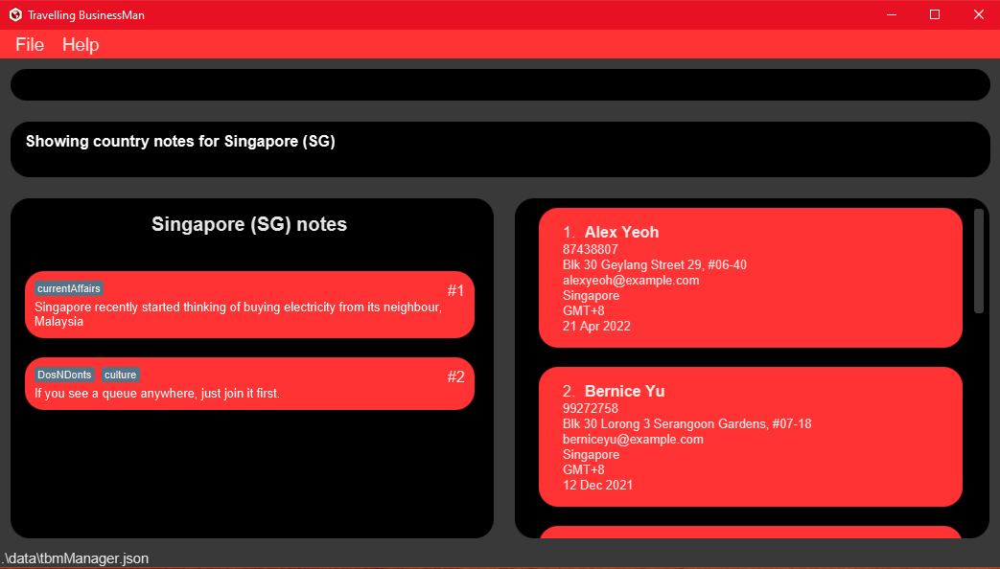

<!-- NTS: end every sentence with a period -->
<div>
    <div>
        
    </div>
    <p>
        <h3><i>Welcome to the Travelling BusinessMan User Guide!</i></h3>
    </p>
    <p>
        <strong><i>Travelling BusinessMan</i></strong>, <strong><i>TBM</i></strong>, is a specialised contact management system targeted at business people with many international clients.
    </p>
    <p>
        <strong><i>TBM</i></strong> sorts and organises your clients for you, streamlines your workflow, improves business efficiency and so much more. All this is at the convenience of the Command-Line Interface. <strong><i>TBM</i></strong> does more than just tracking your clients!<br>
    </p>
    <p>
        This user guide will be a starting point for you in getting oriented with how <strong><i>TBM</i></strong> works and how you can integrate it into your professional journey!
    </p>
</div>

--------------------------------------------------------------------------------------------------------------------

  
 


--------------------------------------------------------------------------------------------------------------------

## Table of Contents

* Table of Contents
{:toc}

--------------------------------------------------------------------------------------------------------------------

## Quickstart

<div markdown="block" class="alert alert-info">

**:information_source:** Please refer to the [Introduction to UI](#appendix-a---introduction-to-the-ui) if you're  trying TBM out for the first  time.
</div>


Before you start using **_TBM_**, 

1. Ensure you have Java 11.

1. Download the application file (.jar file) from [here](https://github.com/AY2021S1-CS2103T-F11-4/tp/releases).

1. Navigate to the directory that the application file was downloaded to. To start the application:

    1. Double click on the `TBM.jar` file and the application will start shortly.

    1. Alternatively, open any shell terminal in the current directory and run the command `java -jar TBM.jar`.

Now that you have started **_TBM_**,

1. Type any command in the command box and press Enter to execute it.

1. ***(Recommended for new users)*** The [`help`](#Viewing-help-help) command will show a help page of some commonly
 used commands to fully utilise **_TBM_**.

   * ***Either*** press the **F1** key on your keyboard, ***or*** type the [`help`](#Viewing-help-help) command in the command box and
    press Enter to execute it. e.g. typing [`help`](#Viewing-help-help) and pressing Enter will open the help window.<br>

--------------------------------------------------------------------------------------------------------------------

## Features

The following section outlines the commands supported by **_TBM_**. A short description is given for each command along with the format that they should be executed with. Complex commands also come with examples to demonstrate the purpose that the command serve.

Certain commands require parameters and the summary of these parameters as well as their prefixes and constraints can be found in our [parameters summary table](#Parameter-constraints-summary)

A summary of all commands can be found in our [command summary table](#Command-summary)
<div markdown="block" class="alert alert-info">

**:information_source: Notes about the command format:**<br>

* Words in `UPPER_CASE` are the parameters to be supplied by the user.<br>
  e.g. in `client add n/NAME`, `NAME` is a parameter which can be used as `client add n/John Doe`.

* Items in square brackets are optional.<br>
  e.g `n/NAME [ce/CONTRACT_EXPIRY_DATE]` can be used as `n/John Doe ce/2-3-2020`(both supplied) or as `n/John Doe`(optional parameter missing).

* Items in round brackets mean that you have to supply at least one of them.<br>
  e.g. `INDEX (n/NAME) (n/PHONE_NUMBER)` can be used as `1 n/John Doe` or `1 p/98899889` or `1 n/John Doe p/98899889`, but not as `1` (i.e. both items are not supplied).

* Items with `…`​ after them can be used multiple times including zero times.<br>
  e.g. `[t/TAG]…​` can be used as ` ` (i.e. 0 times), `t/friend`, `t/friend t/family` etc.

* Parameters can be in any order.<br>
  e.g. if the command specifies `n/NAME p/PHONE_NUMBER`, `p/PHONE_NUMBER n/NAME` is also acceptable.

</div>

### Viewing all saved clients: `list`

Shows a list of all clients in **_TBM_**.

Format: `list`

### Viewing help: `help`

Shows commonly used commands for **_TBM_** in a new help window. Pressing Esc will close this window.


Format: `help`

### Adding a client: `client add`

Adds a new client to **_TBM_**.

Format: `client add n/NAME p/PHONE_NUMBER e/EMAIL a/ADDRESS c/COUNTRY_CODE tz/TIMEZONE [ce/CONTRACT_EXPIRY_DATE]`

Example:

* Command: `client add n/Katya p/98123456 e/katya@yahoo.com a/Vladivostok, Nevelskogo, bld. 15, appt. 256 c/RU tz/GMT+3 ce/2-3-2020`<br>

  Adds a new client with name **Katya**, phone number **98123456**, email **katya@yahoo.com**, address **Vladivostok, Nevelskogo, bld. 15, appt. 256**, country **Russia**, timezone **GMT+3**, contract expiry date **2 Mar 2020**.

### Viewing a client: `client view`

Views the client specified by the `INDEX` parameter.
<div markdown="block" class="alert alert-info">

**:information_source:** Please refer to the [this](#view-for-client) if you need to be re-acquainted with the UI for client related commands
</div>

Format: `client view INDEX`

Example:

Given the current list of clients:
```
1. Katya
2. Alex
```
Command: `client view 2`

The information for the client at index 2 of the list will be shown. In the example above, Alex's information will be displayed.

### Finding clients: `client find`

Finds clients whose names contain any of the given keywords.

Format: `client find KEYWORD [MORE_KEYWORDS]`

* The search is case-insensitive. e.g `hans` will match `Hans`.
* The order of the keywords does not matter. e.g. `Hans Bo` will match `Bo Hans`.
* Only the name is searched.
* Only full words will be matched e.g. `Han` will not match `Hans`.
* Clients matching at least one keyword will be returned (i.e. OR search). e.g. `Hans Bo` will return `Hans Gruber` and `Bo Yang`.

Examples:

* Command: `client find katya`

   Finds all clients with names that matches **katya**.

* Command: `client find Katya Hans`

   Finds all clients whose names contain either **Katya** or **Hans**.

### Editing a client: `client edit`

Edits a client's information by their index in the list view. Only edits the fields that have been passed in as parameters.

Format: `client edit INDEX (n/NAME) (p/PHONE) (e/EMAIL) (a/ADDRESS) (c/COUNTRY_CODE) (tz/TIMEZONE) (ce/CONTRACT_EXPIRY)`

Examples:

* Command: `client edit 5 n/Katya`

    Only edits **name** to `Katya`, other fields remain the same.

* Command: `client edit 4 n/Alek p/34842097 e/dcsdcr@nus.edu.sg`

    Edits **name** to `Alek`, **phone number** to `34842097` and **email** to `dcsdcr@nus.edu.sg`, other fields remain the same.

* Command: `client edit 1 c/JP tz/GMT+7`

    Edits **country** to `Japan` and **timezone** to `GMT+7`, other fields remain the same.

Given the client below:

```
Client 1
--------
Name: Alex
Phone: 911
Country: Singapore
Timezone: GMT+8
...(other fields omitted)
```
Command: `client edit 1 c/JP tz/GMT+7`

Alex's **country** and **timezone** will be edited and the following will be the result.

```
Client 1
--------
Name: Alex
Phone: 911
Country: Japan
Timezone: GMT+7
...(other fields omitted)
```

### Deleting a client: `client delete`

Deletes a client by their index in the list view.

Format: `client delete INDEX`

Example:

* Command: `client delete 5`

    Deletes the client at index 5 of the list panel.

### Saving data

Your data is automatically saved after every change. The file is saved in the ubiquitous `.json` format, which
allows you to edit the file manually without even opening **TBM** up.
The location for this file is `./data/tbmManager.json` (indicated at the bottom left of the window), where the
 `.` represents the directory where you have saved `TBM.jar`. Here's a snippet of this editable text file:

```json5
{
  "clients" : [ {
    "name" : "Alex Yeoh",
    "phone" : "87438807",
    "email" : "alexyeoh@example.com",
    "address" : "Blk 30 Geylang Street 29, #06-40",
    "country" : "SG",
    "timezone" : "GMT+8",
    "contractExpiryDate" : "21-4-2022",
    "lastModifiedInstant" : "2020-01-01T00:00:00Z",
    "clientNotes" : [ {
      "contents" : "Wants to take his wife to Norway for New Years' Day",
      "countryCode" : "NULL_CC",
      "tags" : [ "romantic", "holidayPlans", "travel" ]
    } ]
  } ]
  . . . 
}
```

<div markdown="block" class="alert alert-info">
**:information_source:** Tweaking this file should be done <strong><i>only</i></strong> if you're familiar with JSON
. If you're new to JSON, <a href="https://www.json.org/json-en.html">here's</a> a good place to learn more.
</div>

### Adding client notes: `client note add`

Format: `client note add CLIENT_INDEX nt/NOTE_STRING [t/TAG]...`

Examples:

* Command: `client note add 1 t/pref nt/wants meetings to be as short as possible (preferably 30 mins)`

    Adds a **note** with a **tag** to the **first** client in the list.

* Command: `client note add 2 nt/prefers emails to calls`

    Adds a **note** to the **second** client in the list.

* Command: `client note add 4 t/meeting nt/need to slowly convince him to sign the contract`

    Adds a **note** with a **tag** to the **fourth** client in the list.

### Deleting client notes: `client note delete`

Deletes a note of a client (denoted by a client's index) by the note's index.

Format: `client note delete CLIENT_INDEX NOTE_INDEX`

Examples:

Given a list of notes:

```
Client: 3
Notes:
1. Loves dogs [tag: pref]
2. Hates cats [tag: pref]
```

Command: `client note delete 3 2`

The above command deletes the note regarding "Hates cats". The resulting information will look like:

```
Client: 3
Notes:
1. Loves dogs [tag: pref]
```

### Editing client notes: `client note edit`

Edits a note of a client (denoted by that client's index) by the note's index. Supplying tags to the command will add the tags onto the current existing tags for that note.

Format: `client note edit CLIENT_INDEX NOTE_INDEX nt/NOTE_STRING [t/TAG]...`

Examples:

Given a list of notes:

```
Client: 3
Notes:
1. Loves dogs [tag: pref]
2. Hates cats [tag: pref]
3. Apprehensive of resigning contract [tag: meeting]
```

Command: `client note edit 3 2 nt/Loves cats t/important`

The original note containing "Hates cats" will be changed to "Loves cats" with an additional tag (on top of the existing one). The resulting list will look like:

```
Client: 3
Notes:
1. Loves dogs [tag: pref]
2. Loves cats [tag: pref, important]
3. Apprehensive of resigning contract [tag: meeting]
```

### Filtering clients by country: `country filter`

Filters the list of clients by a specified country.

Format: `country filter c/COUNTRY_CODE`

Examples:

* Command: `country filter c/SG`

    Filters by contacts in Singapore.

* Command: `country filter c/RU`

    Filters by contacts in Russia.

### Viewing notes for a country: `country note view`

<div markdown="block" class="alert alert-info">

**:information_source:** Please refer to the [this](#appendix-a---introduction-to-the-ui) if you need to be re-acquainted with the UI for country related commands
</div>


Views the list of country notes from the country specified by the country code.
If no country code is given, all country notes in **_TBM_** will be shown.

Format: `country note view [c/COUNTRY_CODE]`

Examples:

* Command: `country note view`

    All country notes in **_TBM_** will be displayed.

* Command: `country note view c/SG`

    Only country notes for Singapore will be displayed.

* Command: `country note view c/IN`

    Only country notes for India will be displayed.

### Adding notes for a country: `country note add`

Adds a note that is associated with a specific country.

Format: `country note add c/COUNTRY_CODE nt/NOTE_STRING [t/TAG]...`

Examples:

* Command: `country note add c/SG nt/has one of the lowest corporate taxes in the world t/tax`

    Adds a **note** with a **tag** for Singapore.

* Command: `country note add c/CN nt/building good relations (guanxi) is important when conducting business here t/intercultural`

    Adds a **note** with a **tag** for China.

* Command: `country note add c/IN nt/is world's fastest growing economy`

    Adds a **note** for India.

### Editing notes for a country: `country note edit`

Edits a note that is associated with a specific country at the given index based on the current view of the list panel displaying country notes. Supplying tags to the command will add the tags onto the current existing tags for that note.

The country note list panel can be viewed using the command `country note view`.

Format: `country note edit INDEX (nt/NOTE_STRING) (t/TAG)...`

Example:

Given the list of country notes in the country note list panel:

```
China
--------
1. Speaks Mandarin [tag: language]

Russia
--------
2. Speaks Russian [tag: language]

Singapore
--------
3. Speaks English
```

Command: `country note edit 3 nt/Speaks Singlish t/language`

Edits the third country note in the country notes panel. In this case, it will be the note under Singapore. The resulting list will look like:

```
China
--------
1. Speaks Mandarin [tag: language]

Russia
--------
2. Speaks Russian [tag: language]

Singapore
--------
3. Speaks Singlish [tag: language]
```

### Deleting notes for a country: `country note delete`

Deletes a note that is associated with a specific country at the given index based on the current view of the list panel displaying country notes.

Format: `country note delete INDEX`

Example:

* Command: `country note delete 1`

    Deletes the country note at index 1 of the country notes list panel.

### Getting suggestions on clients: `suggest`

Obtains a list of clients based on the suggestion type(s) passed in.

Format: `suggest by/SUGGESTION_TYPE [by/SUGGESTION_TYPE]...`

Examples:

* Command: `suggest by/available`

    Obtains a list of clients where the time is 1800-2200 in the client's timezone (off work hours).

* Command: `suggest by/frequency`

    Obtains a list of clients based on the last time their details were edited in **_TBM_**. Clients who have not been contacted for a longer period will be the first in the list.

* `suggest by/contract`

    Obtains a list of clients based on their current contract details. Clients whose contracts are expiring will be shown first.

* `suggest by/contract by/available`

    Obtains a list of clients based on their current contract details but only clients who are available will be shown. Clients whose contracts are expiring will be shown first.

### Clearing all entries: `clear`

Deletes all existing information from the application. The end result will be an application with no client/note/country data.

Format: `clear`

### Exiting the program: `exit`

Exits the program.

Format: `exit`

--------------------------------------------------------------------------------------------------------------------

## FAQ

**Q**: How do I transfer my data to another Computer?<br>
**A**: Install the app in the other computer and overwrite the empty data file it creates with the file that contains the data of your previous **_TBM_** home folder.<br>

--------------------------------------------------------------------------------------------------------------------

## Command summary

Action | Format, Examples
--------|------------------
**List all clients** | `list`
**Add client** | `client add n/NAME p/PHONE_NUMBER e/EMAIL a/ADDRESS c/COUNTRY_CODE tz/TIMEZONE [ce/CONTRACT_EXPIRY_DATE]` <br> e.g., `client add n/Katya p/98123456 e/katya@yahoo.com a/Vladivostok, Nevelskogo, bld. 15, appt. 256 c/RU tz/GMT+3 ce/22-12-2020`
**Edit client** | `client edit INDEX (n/NAME) (p/PHONE) (e/EMAIL) (a/ADDRESS) (c/COUNTRY_CODE) (tz/TIMEZONE) (ce/CONTRACT_EXPIRY_DATE)`<br> e.g.,`client edit 3 c/JP tz/GMT+7`
**View client** | `client view INDEX` <br> e.g., `client view 2`
**Find client** | `client find KEYWORD [MORE_KEYWORDS]`<br> e.g., `client find Hans`
**Delete client** | `client delete INDEX`<br> e.g., `client delete 3`
**Add client note** | `client note add CLIENT_INDEX nt/NOTE_STRING [t/TAG]...` <br> e.g., `client note add 4 t/meeting nt/need to slowly convince him to sign the contract`
**Delete client note** | `client note delete CLIENT_INDEX NOTE_INDEX` <br> e.g., `client note delete 3 2`
**Edit client note** | `client note edit CLIENT_INDEX NOTE_INDEX nt/NOTE_STRING [t/TAG]...` <br> e.g., `client note edit 3 2 nt/Loves cats`
**Filter by country** | `country filter c/COUNTRY_CODE` <br> e.g., `country filter c/SG`
**View country note** | `country note view [c/COUNTRY_CODE]` <br> e.g., `country note view c/SG`
**Add country note** | `country note add c/COUNTRY_CODE nt/NOTE_STRING [t/TAG]...` <br> e.g., `country note add c/SG nt/has one of the lowest coporate taxes in the world t/tax`
**Edit country note** | `country note edit INDEX (nt/NOTE_STRING) (t/TAG)...` <br> e.g., `country note edit 1 nt/has one of the lowest coporate taxes in the world t/tax`
**Delete country note** | `country note delete INDEX` <br> e.g., `country note delete 1`
**Get suggestions** | `suggest by/SUGGESTION_TYPE [by/SUGGESTION_TYPE]...` <br> e.g., `suggest by/available by/frequency`
**Clear** | `clear`
**Exit** | `exit`
**Help** | `help`


## Parameter constraints summary

Parameter | Prefix | Constraints, Examples
--------|------------------| ----------
**NAME** | `n/` | Names should only contain alphanumeric characters and spaces, and it should not be blank. <br> e.g. `n/John Doe`
**PHONE_NUMBER** | `p/` | Phone numbers should only contain numbers, and it should be at least 3 digits long. <br> e.g. `p/9123 4567`
**EMAIL** | `e/` | Emails should be of the format local-part@domain. <br> e.g. `e/katya@yahoo.com`
**ADDRESS** |`a/` | Addresses can take any values, and it should not be blank. <br> e.g. `Vladivostok, Nevelskogo, bld. 15, appt. 256`
**COUNTRY_CODE** | `c/` | A 2-letter country code that follows the ISO3166 specification. [List](https://en.wikipedia.org/wiki/List_of_ISO_3166_country_codes) of country codes. <br> e.g. `c/SG` (Singapore)
**TIMEZONE** | `tz/` | Timezone should be given in offsets relative to [Greenwich Mean Time](https://en.wikipedia.org/wiki/Greenwich_Mean_Time). <br> e.g. `tz/GMT+8`
**CONTRACT_EXPIRY_DATE** | `ce/` | Date should be given in the format "DD-MM-YYYY". <br> e.g. `ce/10-10-2020`
**NOTE_STRING** | `nt/` | Notes can take any values, and it should not be blank. <br> e.g. `nt/Likes cats`
**TAG** | `t/` | Tags names should be alphanumeric and have a maximum of 45 characters. <br> e.g. `t/important`
**SUGGESTION_TYPE** | `by/` | Suggestion types can only be either `available`, `contract` or `frequency`. <br> e.g. `by/available`
**INDEX** | - | Index is a number greater than 0 that is based on the numberings beside each client or note. <br> e.g. `1` would refer to the first client or note.

--------------------------------------------------------------------------------------------------------------------
## Appendix A - Introduction to the UI

### Start Page

The diagram below shows the key UI elements of TBM upon first start-up.


* **Command Box** allows you to input  commands in their correct syntax to interact with TBM.

* **Client List Panel** will always allow you to view your client's information at a go. It's scrollable so that you 
never have to worry about not being able to see all your important clients at a single glance!

* **Client Card** will show you brief information a particular client. 

* **Result Display** will show you the output of executing your command.
    * It indicates successful commands.
    
    * On the off-chance there's a syntax issue, TBM will remind you of the correct syntax it expects, something like this:
 
     
     
* **Generic Widget View Box** is aptly named because it shall spawn *Client Cards* or *Country Cards* when
 relevant commands are sent. Initially it will show you your local time, to the precise second and your own location.
   
     


### UI when Viewing Clients

The diagram below is what you should see upon viewing a particular client (i.e. firing up the command `client view 1
`). It shows how to identify a particular  client's  `CLIENT_INDEX`, and an  associated note's `CLIENT_NOTE_INDEX`.


Here, the **Client Card** displaying the note that's tagged as `hobbies` is referred to by the `CLIENT_INDEX` of `1`.

Being able to identify these is key to adding, deleting and editing client notes as well as editing clients.

### UI when Viewing Country

Similarly, `COUNTRY_NOTE_INDEX` can be identified like so by referring to the index indicated on the **Country Card**:


<p align="center">
   <strong><i>{End of Appendix A, please return to the <a href="#table-of-contents">Table of Contents</a> } </i
   ></strong> 
</p>


--------------------------------------------------------------------------------------------------------------------

