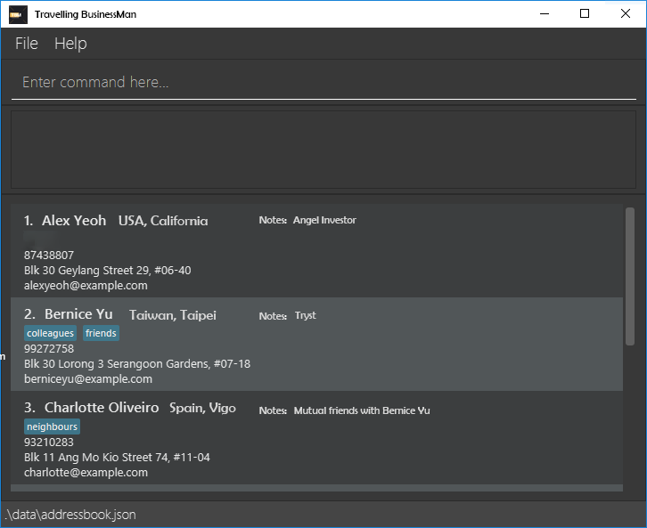

**Travelling Businessman is a desktop application for managing your client contact details, organized with a focus on their country of residence.** While it has a GUI, most of the user interactions happen using a CLI (Command Line Interface).

* If you are interested in using Travelling Businessman, head over to the [_Quick Start_ section of the **User Guide**](UserGuide.html#quick-start).
* If you are interested about developing Travelling Businessman, the [**Developer Guide**](DeveloperGuide.html) is a good place to start.

**Acknowledgements**

* Libraries used: [JavaFX](https://openjfx.io/), [Jackson](https://github.com/FasterXML/jackson), [JUnit5](https://github.com/junit-team/junit5), [JFoenix](https://github.com/jfoenixadmin/JFoenix), [TestFX](https://github.com/TestFX)
* Codebase referenced: [Address Book 4](https://github.com/se-edu/addressbook-level4)
